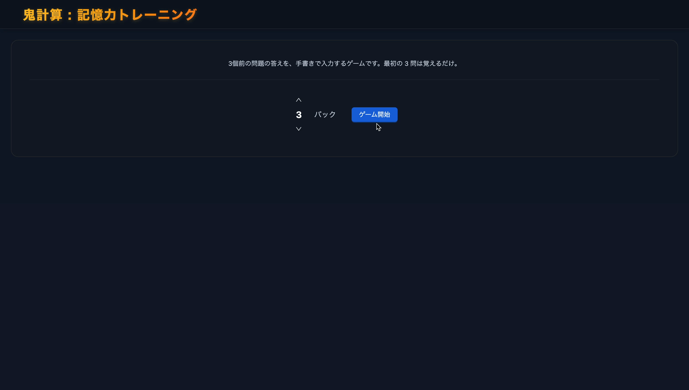
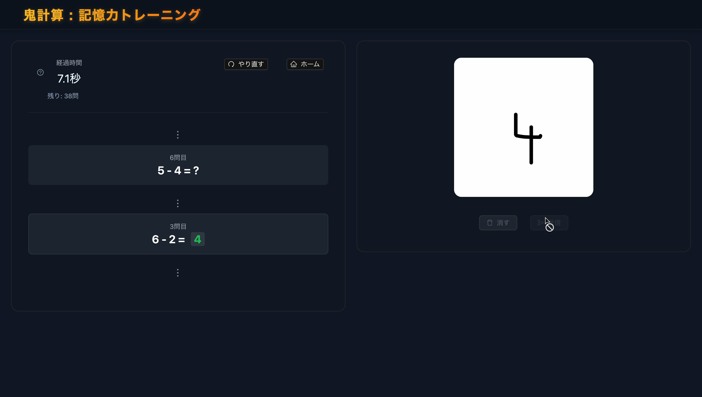
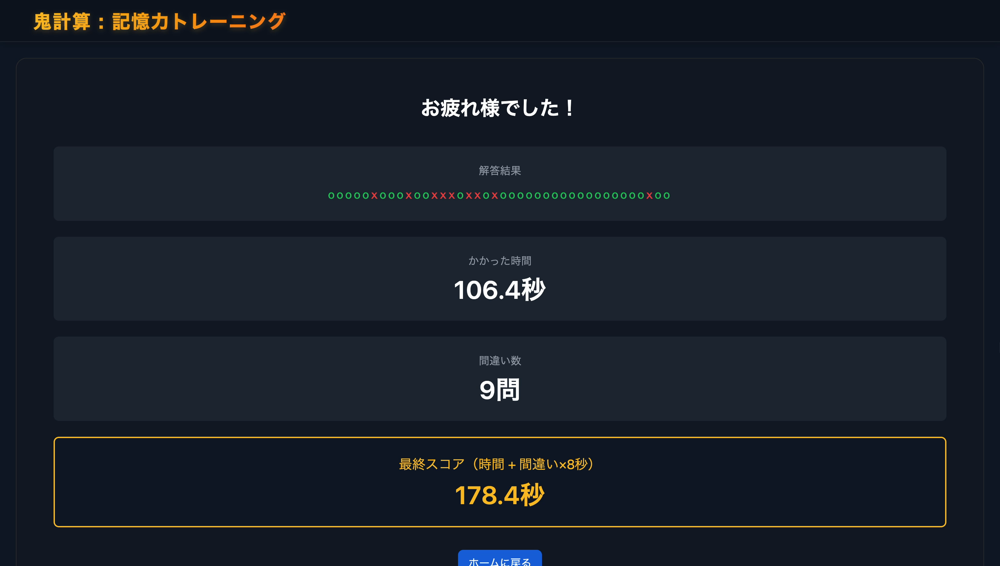

# Oni-Calc: 記憶力脳トレゲーム

## 概要

Oni-Calcは、手書き数字認識技術を活用した記憶力トレーニングゲームです。ユーザーは一桁同士の加減算問題を連続で解きながら、**n個前の問題の答え**を記憶して手書きで入力する必要があります。

## デモ動画

[デモ動画を見る](https://youtu.be/7woltqHQpTk)  
※クリックでYouTubeに移動します。

## スクリーンショット

| ホーム画面 | 問題プレイ中 | リザルト画面 |
|:-----------:|:-------------:|:--------------:|
|  |  |  |


## ゲームの仕組み

### 基本ルール
1. **問題表示**: 一桁同士の加減算問題が連続で表示される
2. **記憶タスク**: 現在の問題ではなく、**n個前の問題の答え**を手書きで入力
3. **脳トレ効果**: n個分の答えを記憶しながら計算することで、ワーキングメモリを鍛える

### 例（n=3の場合）
```
問題1: 3 + 4 = ?  → 答え: 7 (記憶)
問題2: 8 - 2 = ?  → 答え: 6 (記憶)
問題3: 5 + 1 = ?  → 答え: 6 (記憶)
問題4: 9 - 3 = ?  → ここで問題1の答え「7」を手書き入力
問題5: 2 + 7 = ?  → ここで問題2の答え「6」を手書き入力
...
```

## 技術構成

### サーバー側（Backend）
- **フレームワーク**: FastAPI, Python

### クライアント側（Frontend）
- **フレームワーク**: React 19.2.0
- **UIライブラリ**: Ant Design 5.27.6
- **手書き入力**: Canvas API

### 機械学習（ML Training & Inference）
- CNNをPyTorchを用いて実装。
- **学習**:
  - **スクリプト**: `ml-training/make_model.py`
  - **データセット**: MNIST
  - **出力**: 学習済みモデル（`backend/models/model.pt`）
- **推論**:
  - **推論ロジック**: `backend/models/inference.py` + `backend/app.py`
  - **画像前処理**: `backend/utils/preprocessing.py`（`preprocess_png_like_mnist`関数）
    - 黒背景・白文字への反転（MNIST互換のため）
    - バウンディングボックス切出し
    - 長辺20pxへの等比縮小
    - 28×28パディング & 重心センタリング
    - 0–1正規化

## セットアップ

### 前提条件
- Python 3.11以上
- Node.js 16以上
- npm または yarn

### バックエンドのセットアップ

1. Python仮想環境を作成（推奨）
```bash
python -m venv venv
source venv/bin/activate  # Windows: venv\Scripts\activate
```

2. 依存関係のインストール
```bash
cd backend
pip install -r requirements.txt
```

3. バックエンドサーバーの起動
```bash
python app.py
```

   デフォルトで `http://0.0.0.0:8000` で起動します。

### フロントエンドのセットアップ

1. 依存関係のインストール
```bash
cd frontend
npm install
```

2. 開発サーバーの起動
```bash
npm start
```

デフォルトで `http://localhost:3000` で起動します。

### モデルの学習

モデルを再学習する場合：

```bash
cd ml-training
pip install -r requirements.txt
python make_cnn_model.py
```

学習済みモデルは `model.pt` に保存されます。

## 使用方法

1. **バックエンドサーバーを起動**
   ```bash
   cd backend
   python app.py
   ```

2. **フロントエンドを起動**
   ```bash
   cd frontend
   npm start
   ```

3. **ブラウザでアクセス**
   `http://localhost:3000` にアクセスしてゲームを開始し、計算問題に答えます

## API仕様

### エンドポイント

#### `POST /recognize`
手書き数字画像を認識するメインエンドポイント

**パラメータ:**
- `file` (UploadFile, required): PNG形式の画像ファイル（最大10MB）

**レスポンス例（成功時）:**
```json
{
  "success": true,
  "digit": 7,
  "confidence": 0.987,
  "top3": [
    {"digit": 7, "prob": 0.987},
    {"digit": 1, "prob": 0.008},
    {"digit": 9, "prob": 0.003}
  ],
  "message": "認識結果: 7 (信頼度: 0.987)",
}
```

**レスポンス:**
- `success`: 処理が成功したかどうか（boolean）
- `digit`: 認識された数字（0-9）
- `confidence`: 認識の信頼度（0.0-1.0）
- `top3`: 上位3つの候補（数字と確率のペア）
- `message`: 人間が読める形式のメッセージ


## 注意・免責事項

本アプリ **Oni-Calc** は、任天堂株式会社の「脳を鍛える大人のDSトレーニング」シリーズに触発されて制作した**個人学習用プロジェクト**です。  
オリジナル作品の著作権および商標は、すべて任天堂株式会社に帰属します。

本プロジェクトは **非商用目的** であり、  
・プログラミングおよび機械学習技術の習得  
・手書き数字認識モデル（MNIST）を活用したUI/UX実験  
・Webアプリケーション開発の練習  
を目的としています。

よって、本アプリは一般公開・配布・販売を意図しておりません。
